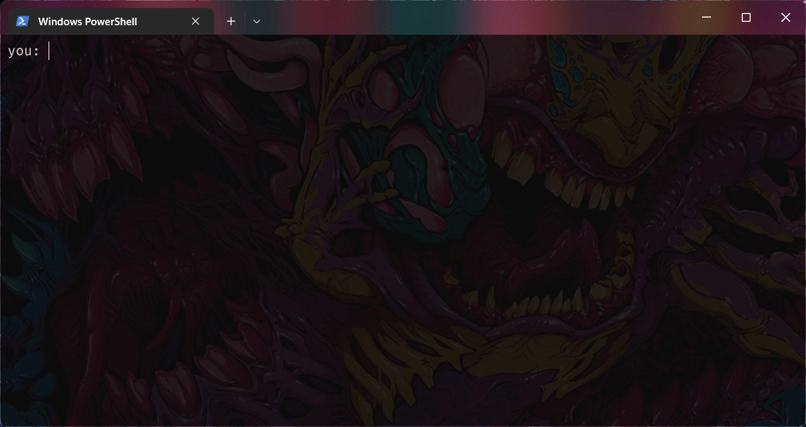

<a name="readme-top"></a>


<!-- PROJECT LOGO -->
<br />
<div align="center">
  
  <h3 align="center">ChatGPT-terminal</h3>
  <p align="center">
    An AI-powered chat system that allows users
    <br>to communicate through a terminal interface.
    <br>Uses ChatGPT's API by OpenAI.
    <br /><br />
  </p>
</div>


<!-- TABLE OF CONTENTS -->
<details>
  <summary>Table of Contents</summary>
  <ol>
    <li>
      <a href="#about-the-project">About The Project</a>
      <ul>
        <li><a href="#built-with">Built With</a></li>
      </ul>
    </li>
    <li>
      <a href="#getting-started">Getting Started</a>
      <ul>
        <li><a href="#installation">Installation</a></li>
      </ul>
    </li>
    <li><a href="#usage">Usage</a></li>
    <li><a href="#license">License</a></li>
    <li><a href="#acknowledgments">Acknowledgments</a></li>
  </ol>
</details>


<!-- ABOUT THE PROJECT -->
## About The Project

This project is an AI-powered chat system that is accessible through a terminal interface. It allows users to communicate with an artificial intelligence in a way that simulates human conversation. The AI is trained on a large dataset of human conversations and is designed to respond in a natural and engaging way. This terminal app is meant to be a fun and interactive way to learn more about AI and how it can be used to enhance human communication.

<p align="right">(<a href="#readme-top">back to top</a>)</p>


### Built With

![Python][Python-url]

<p align="right">(<a href="#readme-top">back to top</a>)</p>


<!-- GETTING STARTED -->
## Getting Started

To get a local copy up and running follow these simple steps.

### Installation

1. Clone the repo

    ```sh
    git clone https://github.com/kamillobinski/chatgpt-terminal.git
    ```

2. Create a .env file in the root directory of the project

    ```sh
    cd ./chatgpt-terminal
    touch .env
    ```

3. Add the required environment variables to the .env file - follow this [guide](./docs/auth.md)

    ```sh
    AI_SESSION_TOKEN=session_token_value
    ```
    

4. Install required packages via requirements.txt

    ```sh
    pip install -r requirements.txt
    ```

5. Execute app

    ```sh
    python main.py
    ```

<p align="right">(<a href="#readme-top">back to top</a>)</p>


<!-- USAGE -->
## Usage



<p align="right">(<a href="#readme-top">back to top</a>)</p>


<!-- LICENSE -->
## License

Uknown - project license not set.

<p align="right">(<a href="#readme-top">back to top</a>)</p>


<!-- DISCLAIMERS -->
## Disclaimer

This project involves the reverse engineering of an API owned by OpenAI, which may be a violation of the terms of service of the company. The author of this project is not responsible for any actions taken by users of this project, and by using this project, you acknowledge that you are doing so at your own risk. This project is for educational and research purposes only and is not intended for commercial use. The author does not endorse the use of this project for any illegal or unethical purposes.

<p align="right">(<a href="#readme-top">back to top</a>)</p>


<!-- ACKNOWLEDGMENTS -->
## Acknowledgments

The project uses tools listed below.

* [ChatGPT](https://openai.com/)
* [acheong08/ChatGPT](https://github.com/acheong08/ChatGPT)

<p align="right">(<a href="#readme-top">back to top</a>)</p>


<!-- MARKDOWN LINKS & IMAGES -->
[Python-url]: https://img.shields.io/badge/Python-0769AD?style=for-the-badge&logo=python&logoColor=white